## 언어

언어의 구성요소

- 기호들의 집합 S가 반드시 존재한다 (알파벳)
- S로부터 문장들의 집합 S*를 형성하는 규칙이 반드시 존재한다. (syntax, 문법)
- 규칙에 합당하게 만들어진 문장들이 어떤 의미를 갖는지를 결정할 수 있어야 한다.(semantics, 의미론)

## 형식언어

- 심벌: 기호
- 알파벳: 기호들의 유한집합
- 문자열: 알파벳에 포함된 기호들이 나열된 것
- 공 문자열: 길이가 0인 문자열, 람다로표시

V: 알파벳

V*: V에 속한 기호로 만들어진 문자열의 집합

## 구-구문 문법

Phase-structure grammer G=(V, T, S, P)

V: 기호의 집합

T: 단말 기호(terminal symbol)

S: 시작 기호(start symbol, seed)

P: 생성 규칙(production rule) (=> 로표시)

​	if w=>w', w is replaced by w' 혹은 w produce w'

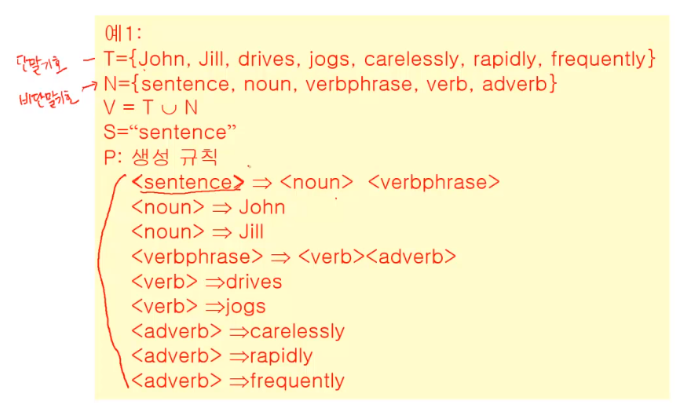

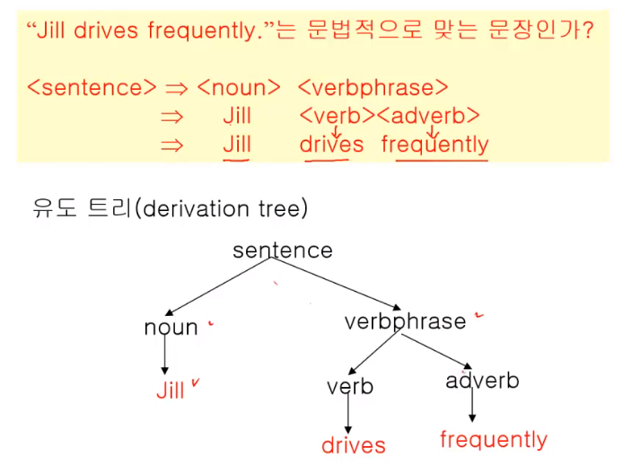

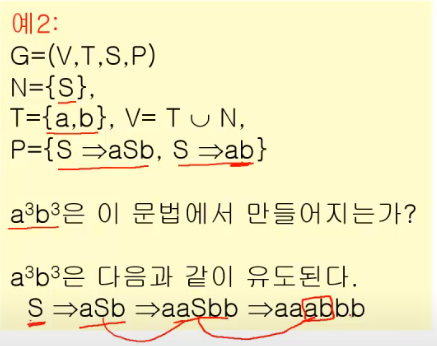

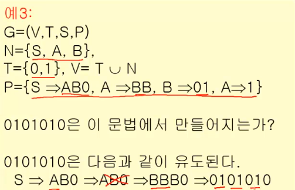

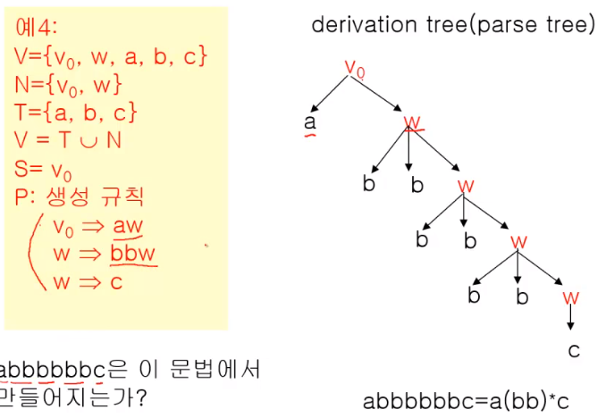

## 언어와 문법

L(G) : 문법 G의 언어, 문법 G를 사용하여 만들어 질 수 있는 문장들의 집합

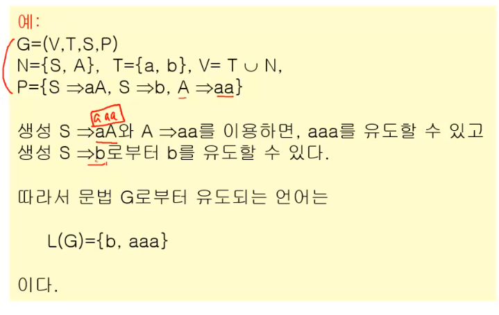

## 문법의 종류

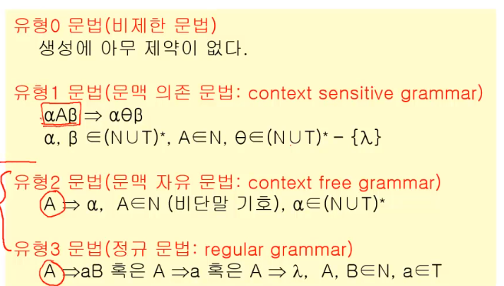

유형1과 2,3의 차이는 =>의 왼쪽에 여러개가 올 수 있냐 하나만 나오냐,

2, 3의 차이는 =>의 오른쪽이 aB, a, 람다로 오느냐, 아니면 이것들을 포함한 어떤것도 올수 있느냐 

유형의 단계가 올라갈수록 제약이 심해짐

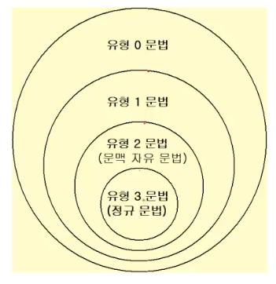

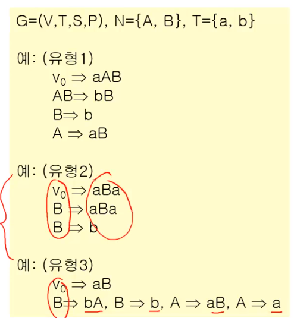

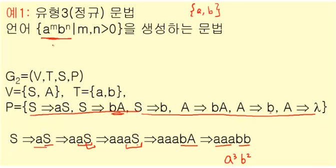

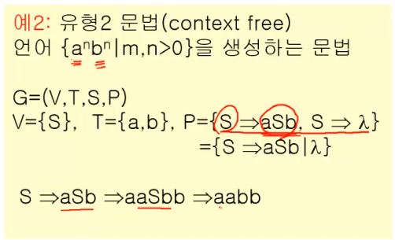

유형 2로밖에 못함

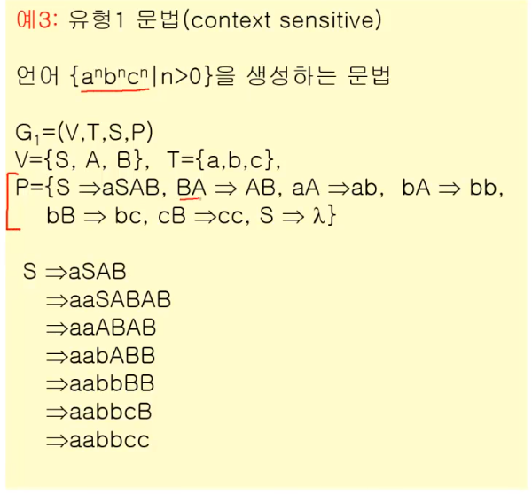

유형 1로밖에 못함

## 문법의 표현

- BNF(Backus-Naur Form) 형식
  - 비단말 기호는<a>로 표시한다.
  - 생성 =>은 ::=로 표시한다.
  - 하나의 비단말 기호로부터 생성되는 여러개의 문자열은 |로 구분한다.
- 문법 다이어그램(syntax diagram)
- 유도 트리(derivation tree)

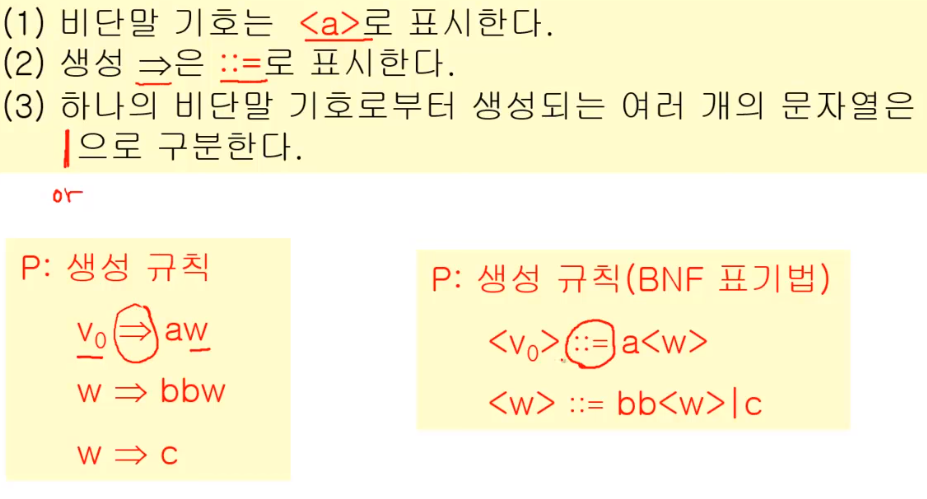

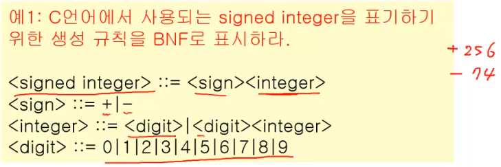

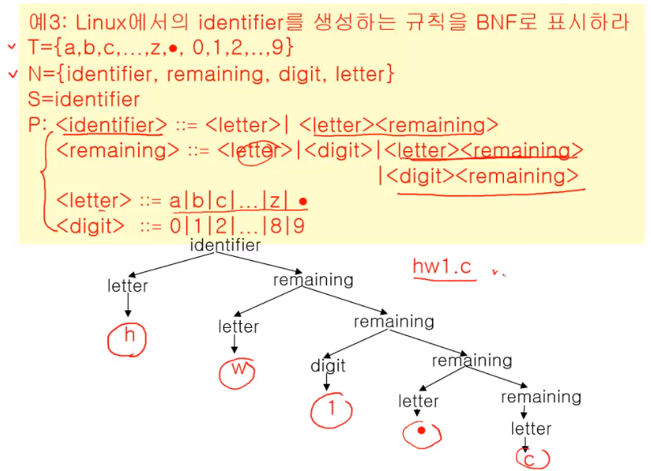

## 문법 다이어그램

- 비단말 기호는 사각형으로, 단말기호는 원으로 그린다.
- 생성 과정은 화살표로서 표시한다.
- 하나의 비단말 기호로부터 생성되는 여러 개의 문자열은

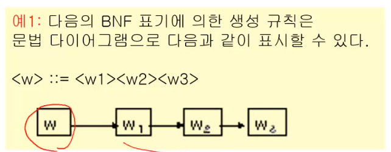

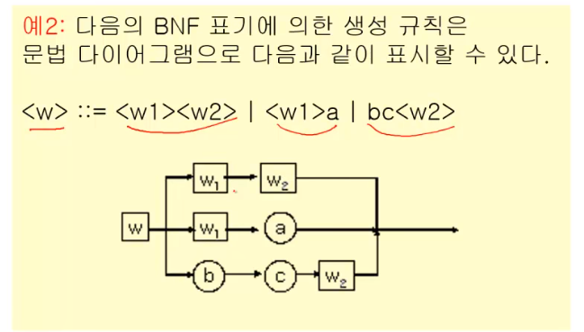

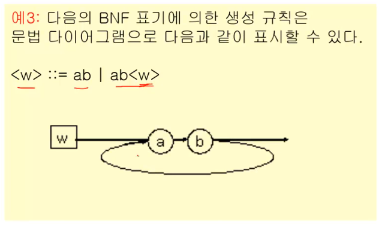

